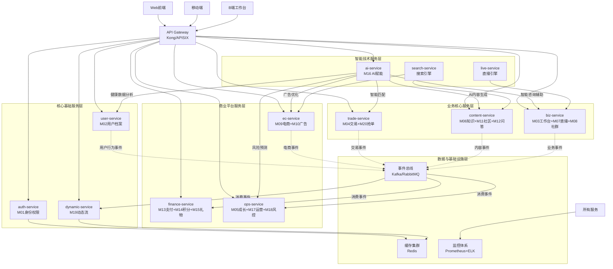

# 🏗️ 健康管理平台微服务架构拆分方案（完整版）

## 📋 方案概述

基于项目20个核心模块和5000万用户目标，将单体Odoo应用拆分为**10个独立的微服务实例**，通过API网关统一接入，事件驱动架构实现服务间通信。

## 🎯 设计原则

1. **业务领域驱动**：每个服务对应明确的业务能力
2. **松耦合高内聚**：服务间通过API/事件通信，避免ORM直接依赖
3. **独立扩展性**：可根据业务压力独立扩展特定服务
4. **技术异构性**：支持不同技术栈，特别适合AI、直播等特殊需求

## 🏗️ 完整架构图



## 🔧 10个微服务实例详细设计

### 1. **身份认证服务 (auth-service)**
```yaml
模块: M01 (统一账户与权限中心)
职责: 用户身份认证、权限管理、会话管理
技术栈: Odoo + PostgreSQL + Redis
数据表: res_users, res_groups, auth_tokens, permissions
API端点:
  - POST /auth/login - 用户登录
  - POST /auth/register - 用户注册
  - GET /auth/verify - Token验证
  - GET /users/{id}/permissions - 权限查询
扩展性: 无状态，可水平扩展
```

### 2. **用户档案服务 (user-service)**
```yaml
模块: M02 (C端个人中心)
职责: 用户健康数据管理、设备绑定、健康评估
技术栈: Odoo + PostgreSQL + Redis
数据表: health_records, device_bindings, health_goals, assessments
API端点:
  - GET /users/{id}/health-data - 健康数据查询
  - POST /users/{id}/health-actions - 记录健康行动
  - PUT /users/{id}/health-goals - 更新健康目标
  - POST /users/{id}/device-bindings - 设备绑定
事件发布: health_action_recorded, goal_achieved, device_data_synced
```

### 3. **动态流服务 (dynamic-service)**
```yaml
模块: M19 (站点动态流系统)
职责: 聚合全平台动态、个性化推荐、Feed流生成
技术栈: FastAPI + MongoDB + Redis + Elasticsearch
数据表: activities, user_feeds, recommendations
API端点:
  - GET /users/{id}/feed - 获取个人动态流
  - GET /trending - 热门动态
  - POST /activities - 创建动态（内部接口）
  - PUT /users/{id}/preferences - 推荐偏好设置
事件订阅: 所有业务事件
特点: 读多写少，大量缓存，个性化算法
```

### 4. **交易核心服务 (trade-service)**
```yaml
模块: M04 (健康服务交易市场) + M20 (抢单与任务分配系统)
职责: 服务交易、抢单匹配、订单管理
技术栈: Odoo + PostgreSQL (强事务)
数据表: service_orders, grab_orders, matching_rules, appointments
API端点:
  - POST /service-orders - 创建服务订单
  - POST /grab-orders - 抢单请求
  - GET /matching/available-orders - 可抢单列表
  - PUT /orders/{id}/status - 更新订单状态
事件发布: order_created, order_assigned, service_completed
特点: 高事务一致性，抢单算法复杂
```

### 5. **内容生态服务 (content-service)**
```yaml
模块: M06 (内容付费与知识商城) + M11 (健康社区) + M12 (问答平台)
职责: 知识付费、社区互动、问答平台
技术栈: Odoo + PostgreSQL + Elasticsearch
数据表: knowledge_contents, community_posts, qa_questions, comments
API端点:
  - GET /contents/courses - 课程列表
  - POST /communities/posts - 发布帖子
  - GET /qna/questions - 问题列表
  - POST /contents/{id}/purchase - 内容购买
事件发布: content_published, question_answered, post_liked
特点: 内容管理，搜索密集型，UGC内容
```

### 6. **商业平台服务 (biz-service)**
```yaml
模块: M03 (B端工作台) + M07 (直播变现中心) + M08 (社群变现中心)
职责: B端工作台、直播管理、社群运营
技术栈: Odoo + PostgreSQL + 腾讯云直播集成
数据表: biz_dashboards, live_streams, community_groups, members
API端点:
  - GET /biz/dashboard - 工作台数据
  - POST /live-streams - 创建直播
  - GET /communities/groups - 社群列表
  - POST /biz/performance - 业绩报表
事件发布: live_started, community_created, biz_activity
特点: B端功能聚合，实时交互，直播技术集成
```

### 7. **电商广告服务 (ec-service)**
```yaml
模块: M09 (健康电商商城) + M10 (广告与流量平台)
职责: 商品交易、广告投放、库存管理
技术栈: Odoo + PostgreSQL + Redis
数据表: products, orders, ad_campaigns, inventories
API端点:
  - GET /products - 商品列表
  - POST /orders - 创建订单
  - GET /ad-campaigns - 广告活动
  - POST /ads/impressions - 广告曝光记录
事件发布: product_purchased, ad_clicked, inventory_updated
特点: 电商逻辑，库存管理，广告投放优化
```

### 8. **金融服务 (finance-service)**
```yaml
模块: M13 (支付与清结算中心) + M14 (积分系统) + M15 (礼物市场)
职责: 支付处理、积分管理、礼物交易
技术栈: Odoo + PostgreSQL (财务数据强一致)
数据表: payments, points_transactions, gift_orders, settlements
API端点:
  - POST /payments - 创建支付
  - GET /points/balance - 积分余额
  - POST /gifts/purchase - 购买礼物
  - GET /settlements/reports - 结算报表
事件订阅: order_created, service_completed
事件发布: payment_success, points_awarded, gift_sent
特点: 资金安全，事务一致性，合规要求高
```

### 9. **运营平台服务 (ops-service)**
```yaml
模块: M05 (成长与认证体系) + M17 (平台运营后台) + M18 (合规与风控中心)
职责: 健康师评级、平台运营、风控合规
技术栈: Odoo + PostgreSQL + 大数据分析
数据表: ratings, operations, risk_rules, audit_logs
API端点:
  - GET /ops/ratings - 健康师评级
  - POST /ops/notifications - 发送通知
  - GET /risk/alerts - 风控警报
  - POST /analytics/reports - 数据分析
事件订阅: 所有业务事件用于风控和分析
特点: 后台管理，数据密集型，批量处理
```

### 10. **AI智能服务 (ai-service)**
```yaml
模块: M16 (AI赋能中心)
职责: AI内容生成、咨询辅助、数据洞察
技术栈: FastAPI + Python AI框架 + GPU资源
数据表: ai_models, generation_tasks, insights
API端点:
  - POST /ai/content/generate - 内容生成
  - POST /ai/consult/assist - 咨询辅助
  - GET /ai/insights/health - 健康洞察
  - POST /ai/matching/smart - 智能匹配
服务能力:
  - 为content-service提供内容生成
  - 为biz-service提供咨询辅助
  - 为user-service提供健康分析
  - 为trade-service提供智能匹配
  - 为ops-service提供风险预测
特点: GPU密集型，异步处理，模型管理
```

## 🔄 服务间通信架构

### 1. **同步API调用**（直接服务调用）
```python
# 通过API网关的内部服务调用
class TradeService:
    def create_order(self, order_data):
        # 1. 验证用户身份（同步调用auth-service）
        auth_response = api_gateway.call('auth-service', 
            f'/users/{order_data["user_id"]}/verify')
        
        # 2. 检查用户健康数据（同步调用user-service）
        health_response = api_gateway.call('user-service',
            f'/users/{order_data["user_id"]}/health-data')
            
        # 3. 创建订单
        order = self._create_order(order_data)
        
        # 4. 发布异步事件
        event_bus.publish('order_created', order.to_dict())
        
        return order
```

### 2. **异步事件驱动**（解耦复杂业务流程）
```python
# 事件发布示例
class OrderService:
    def complete_service(self, order_id):
        order = self.get_order(order_id)
        order.mark_completed()
        
        # 发布服务完成事件，多个服务异步处理
        event_bus.publish('service_completed', {
            'order_id': order_id,
            'user_id': order.user_id,
            'health_worker_id': order.health_worker_id,
            'completion_time': datetime.now(),
            'rating': order.rating
        })

# 事件消费示例 - 多个服务并行处理
@event_bus.subscribe('service_completed')
class FinanceServiceHandler:
    def handle_service_completed(self, event):
        # 处理支付分账
        self.process_settlement(event)

@event_bus.subscribe('service_completed')        
class DynamicServiceHandler:
    def handle_service_completed(self, event):
        # 生成动态流内容
        self.generate_activity(event)

@event_bus.subscribe('service_completed')
class OpsServiceHandler:
    def handle_service_completed(self, event):
        # 更新健康师评级
        self.update_rating(event)
```

## 🚀 部署和扩展策略

### 阶段1：初期（用户<100万）
```yaml
部署架构:
  - 2台物理服务器/云主机
  - 每个服务2个实例（共20个容器）
  - PostgreSQL主从复制
  - Redis单实例缓存

资源分配:
  - auth-service: 2CPU/4GB × 2实例
  - user-service: 2CPU/4GB × 2实例  
  - trade-service: 4CPU/8GB × 2实例（核心业务）
  - 其他服务: 2CPU/4GB × 1实例
```

### 阶段2：成长期（用户100万-2000万）
```yaml
部署架构:
  - Kubernetes集群（10-20个节点）
  - 数据库分库分表
  - Redis集群
  - 消息队列集群

弹性扩展:
  - dynamic-service: 10-20实例（读密集型）
  - trade-service: 5-10实例（交易高峰）
  - auth-service: 4-8实例（认证压力）
  - AI-service: GPU节点弹性伸缩
```

### 阶段3：规模化（用户2000万+）
```yaml
部署架构:
  - 多地域部署
  - 服务网格（Istio）
  - 大数据平台
  - AI专用GPU集群

高级特性:
  - 智能流量调度
  - 故障自动转移
  - 全链路监控
  - 自动化运维
```

## ⚠️ 关键技术挑战与解决方案

### 1. **分布式事务挑战**
```python
# 使用Saga模式+补偿事务
class OrderCreationSaga:
    def execute(self, order_data):
        steps = [
            {'service': 'auth', 'action': 'verify_user', 'compensate': 'lock_user'},
            {'service': 'trade', 'action': 'create_order', 'compensate': 'cancel_order'},
            {'service': 'finance', 'action': 'reserve_payment', 'compensate': 'release_payment'}
        ]
        
        for step in steps:
            try:
                result = self.call_service(step['service'], step['action'])
                self.completed_steps.append(step)
            except Exception as e:
                self.compensate()  # 执行补偿操作
                raise e
```

### 2. **数据一致性保障**
```python
# 最终一致性 + 对账机制
class DataReconciliation:
    def daily_reconciliation(self):
        # 每日对账，修复数据不一致
        trade_orders = trade_service.get_daily_orders()
        finance_payments = finance_service.get_daily_payments()
        
        discrepancies = self.find_discrepancies(trade_orders, finance_payments)
        self.repair_discrepancies(discrepancies)
```

### 3. **服务发现与负载均衡**
```yaml
# Kubernetes Service配置
apiVersion: v1
kind: Service
metadata:
  name: trade-service
spec:
  selector:
    app: trade-service
  ports:
  - port: 80
    targetPort: 8000
  type: ClusterIP
---
apiVersion: apps/v1
kind: Deployment
metadata:
  name: trade-service
spec:
  replicas: 3
  selector:
    matchLabels:
      app: trade-service
  template:
    metadata:
      labels:
        app: trade-service
    spec:
      containers:
      - name: trade-service
        image: trade-service:latest
        ports:
        - containerPort: 8000
```

## 📊 监控与运维体系

### 1. **全链路监控**
```yaml
监控体系:
  - 应用监控: Prometheus + Grafana
  - 日志收集: ELK Stack
  - 链路追踪: Jaeger
  - 业务监控: 自定义Dashboard

关键指标:
  - 服务响应时间 < 200ms
  - 错误率 < 0.1%
  - 系统可用性 > 99.9%
  - 业务转化率监控
```

### 2. **自动化运维**
```yaml
CI/CD流水线:
  - 自动化测试
  - 安全扫描
  - 蓝绿部署
  - 自动回滚

运维自动化:
  - 弹性伸缩: HPA
  - 故障自愈: 健康检查+重启
  - 备份恢复: 自动化备份
```

## ✅ 方案优势总结

1. **完整的业务覆盖**：20个模块全部纳入，无遗漏
2. **合理的服务划分**：基于业务领域，避免过度拆分
3. **良好的扩展性**：支持5000万用户规模
4. **技术灵活性**：支持AI、直播等异构技术栈
5. **运维友好**：完善的监控和自动化体系
6. **成本可控**：按需扩展，资源利用率高

这个架构方案为健康管理平台提供了坚实的技术基础，既能满足当前业务需求，又能支撑未来的规模化发展。
