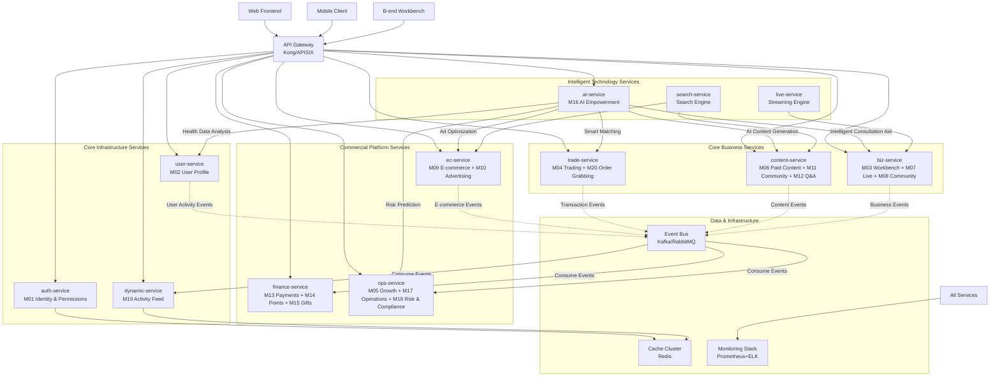

# 🏗️ Health Management Platform Microservices Architecture Splitting Scheme (Full Version)

## 📋 Scheme Overview

Based on the project’s 20 core modules and a target of 50 million users, the monolithic Odoo application is split into **10 independent microservice instances**, unified through an API gateway and communicating via an event-driven architecture.

## 🎯 Design Principles

1. **Domain-Driven**: Each service corresponds to a clear business capability.  
2. **Loose Coupling, High Cohesion**: Services communicate via APIs/events, avoiding direct ORM dependencies.  
3. **Independent Scalability**: Services can scale individually according to business load.  
4. **Tech Heterogeneity**: Supports different tech stacks, ideal for AI, live streaming, and other specialized needs.

## 🏗️ Complete Architecture Diagram



## 🔧 Detailed Design of 10 Microservice Instances

### 1. Authentication Service (auth-service)
```yaml
Module: M01 (Unified Account & Permission Center)
Responsibilities: User authentication, permission management, session handling
Tech Stack: Odoo + PostgreSQL + Redis
Data Tables: res_users, res_groups, auth_tokens, permissions
API Endpoints:
  - POST /auth/login            # User login
  - POST /auth/register         # User registration
  - GET /auth/verify            # Token verification
  - GET /users/{id}/permissions # Permission lookup
Scalability: Stateless, horizontally scalable
```

### 2. User Profile Service (user-service)
```yaml
Module: M02 (C-end Personal Center)
Responsibilities: Managing user health data, device binding, health assessments
Tech Stack: Odoo + PostgreSQL + Redis
Data Tables: health_records, device_bindings, health_goals, assessments
API Endpoints:
  - GET /users/{id}/health-data      # Query health data
  - POST /users/{id}/health-actions  # Record health action
  - PUT /users/{id}/health-goals     # Update health goals
  - POST /users/{id}/device-bindings # Bind device
Event Publishing: health_action_recorded, goal_achieved, device_data_synced
```

### 3. Activity Feed Service (dynamic-service)
```yaml
Module: M19 (Site Activity Feed System)
Responsibilities: Aggregating platform-wide activity, personalized recommendations, feed generation
Tech Stack: FastAPI + MongoDB + Redis + Elasticsearch
Data Tables: activities, user_feeds, recommendations
API Endpoints:
  - GET /users/{id}/feed     # Get user’s personalized feed
  - GET /trending            # Get trending activities
  - POST /activities         # Create activity (internal)
  - PUT /users/{id}/preferences # Set recommendation preferences
Event Subscriptions: All business events
Characteristics: Read-heavy, write-light, heavy caching, personalized algorithms
```

### 4. Core Trading Service (trade-service)
```yaml
Module: M04 (Health Service Marketplace) + M20 (Order Grabbing & Task Allocation)
Responsibilities: Service transactions, order grabbing matching, order management
Tech Stack: Odoo + PostgreSQL (strong transactions)
Data Tables: service_orders, grab_orders, matching_rules, appointments
API Endpoints:
  - POST /service-orders               # Create service order
  - POST /grab-orders                  # Request to grab order
  - GET /matching/available-orders     # List available orders
  - PUT /orders/{id}/status            # Update order status
Event Publishing: order_created, order_assigned, service_completed
Characteristics: High transactional consistency, complex matching algorithms
```

### 5. Content Ecosystem Service (content-service)
```yaml
Module: M06 (Paid Content & Knowledge Marketplace) + M11 (Health Community) + M12 (Q&A Platform)
Responsibilities: Paid content, community interaction, Q&A platform
Tech Stack: Odoo + PostgreSQL + Elasticsearch
Data Tables: knowledge_contents, community_posts, qa_questions, comments
API Endpoints:
  - GET /contents/courses            # List courses
  - POST /communities/posts          # Publish post
  - GET /qna/questions               # List questions
  - POST /contents/{id}/purchase     # Purchase content
Event Publishing: content_published, question_answered, post_liked
Characteristics: Content management, search-intensive, UGC content
```

### 6. Business Platform Service (biz-service)
```yaml
Module: M03 (B-end Workbench) + M07 (Live Monetization Center) + M08 (Community Monetization Center)
Responsibilities: Business console, live stream management, community operations
Tech Stack: Odoo + PostgreSQL + Tencent Cloud Live Integration
Data Tables: biz_dashboards, live_streams, community_groups, members
API Endpoints:
  - GET /biz/dashboard            # Get workbench data
  - POST /live-streams            # Create live stream
  - GET /communities/groups       # List communities
  - POST /biz/performance         # Submit performance report
Event Publishing: live_started, community_created, biz_activity
Characteristics: Aggregated B-end functions, real-time interaction, live streaming integration
```

### 7. E-commerce & Advertising Service (ec-service)
```yaml
Module: M09 (Health E-commerce Mall) + M10 (Advertising & Traffic Platform)
Responsibilities: Product transactions, ad campaigns, inventory management
Tech Stack: Odoo + PostgreSQL + Redis
Data Tables: products, orders, ad_campaigns, inventories
API Endpoints:
  - GET /products               # List products
  - POST /orders                # Create order
  - GET /ad-campaigns           # List ad campaigns
  - POST /ads/impressions       # Record ad impressions
Event Publishing: product_purchased, ad_clicked, inventory_updated
Characteristics: E-commerce logic, inventory management, ad optimization
```

### 8. Financial Service (finance-service)
```yaml
Module: M13 (Payment & Clearing Center) + M14 (Points System) + M15 (Gift Marketplace)
Responsibilities: Payment processing, points management, gift transactions
Tech Stack: Odoo + PostgreSQL (strong financial consistency)
Data Tables: payments, points_transactions, gift_orders, settlements
API Endpoints:
  - POST /payments                   # Create payment
  - GET /points/balance              # Get points balance
  - POST /gifts/purchase             # Purchase gift
  - GET /settlements/reports         # Get settlement reports
Event Subscriptions: order_created, service_completed
Event Publishing: payment_success, points_awarded, gift_sent
Characteristics: Financial security, transactional consistency, compliance requirements
```

### 9. Operations Platform Service (ops-service)
```yaml
Module: M05 (Growth & Certification) + M17 (Platform Operations Backend) + M18 (Compliance & Risk Control)
Responsibilities: Health coach rating, platform operations, risk & compliance
Tech Stack: Odoo + PostgreSQL + Big Data Analytics
Data Tables: ratings, operations, risk_rules, audit_logs
API Endpoints:
  - GET /ops/ratings            # Get coach ratings
  - POST /ops/notifications     # Send notifications
  - GET /risk/alerts            # Get risk alerts
  - POST /analytics/reports     # Submit analytics report
Event Subscriptions: All business events (for risk & analytics)
Characteristics: Backend management, data-intensive, batch processing
```

### 10. AI Empowerment Service (ai-service)
```yaml
Module: M16 (AI Empowerment Center)
Responsibilities: AI content generation, consultation assistance, data insights
Tech Stack: FastAPI + Python AI frameworks + GPU resources
Data Tables: ai_models, generation_tasks, insights
API Endpoints:
  - POST /ai/content/generate    # Generate content
  - POST /ai/consult/assist      # Consultation assistance
  - GET /ai/insights/health      # Health insights
  - POST /ai/matching/smart      # Smart matching
Service Capabilities:
  - Provide content generation to content-service  
  - Provide consultation assistance to biz-service  
  - Provide health analysis to user-service  
  - Provide smart matching to trade-service  
  - Provide risk prediction to ops-service  
Characteristics: GPU-intensive, asynchronous processing, model management
```

## 🔄 Inter-service Communication Architecture

### 1. Synchronous API Calls (Direct Service Invocation)
```python
# Internal service calls via API gateway
class TradeService:
    def create_order(self, order_data):
        # 1. Verify user identity (sync call to auth-service)
        auth_response = api_gateway.call(
            'auth-service', f'/users/{order_data["user_id"]}/verify')
        
        # 2. Check user health data (sync call to user-service)
        health_response = api_gateway.call(
            'user-service', f'/users/{order_data["user_id"]}/health-data')
        
        # 3. Create order
        order = self._create_order(order_data)
        
        # 4. Publish async event
        event_bus.publish('order_created', order.to_dict())
        
        return order
```

### 2. Asynchronous Event-Driven (Decoupled Workflows)
```python
# Example of event publishing
class OrderService:
    def complete_service(self, order_id):
        order = self.get_order(order_id)
        order.mark_completed()
        
        # Publish service completed event for parallel handling
        event_bus.publish('service_completed', {
            'order_id': order_id,
            'user_id': order.user_id,
            'health_worker_id': order.health_worker_id,
            'completion_time': datetime.now(),
            'rating': order.rating
        })

# Example of event consumption by multiple handlers
@event_bus.subscribe('service_completed')
class FinanceServiceHandler:
    def handle_service_completed(self, event):
        # Handle payment settlement
        self.process_settlement(event)

@event_bus.subscribe('service_completed')        
class DynamicServiceHandler:
    def handle_service_completed(self, event):
        # Generate activity feed entry
        self.generate_activity(event)

@event_bus.subscribe('service_completed')
class OpsServiceHandler:
    def handle_service_completed(self, event):
        # Update health coach rating
        self.update_rating(event)
```

## 🚀 Deployment and Scaling Strategy

### Stage 1: Initial (Users < 1 million)
```yaml
Deployment Architecture:
  - 2 physical servers/cloud hosts
  - 2 instances per service (20 containers total)
  - PostgreSQL master-slave replication
  - Single-node Redis cache

Resource Allocation:
  - auth-service: 2 CPU / 4 GB × 2 instances
  - user-service: 2 CPU / 4 GB × 2 instances
  - trade-service: 4 CPU / 8 GB × 2 instances (core business)
  - Other services: 2 CPU / 4 GB × 1 instance each
```

### Stage 2: Growth (Users 1 million–20 million)
```yaml
Deployment Architecture:
  - Kubernetes cluster (10–20 nodes)
  - Database sharding
  - Redis cluster
  - Message queue cluster

Elastic Scaling:
  - dynamic-service: 10–20 instances (read-intensive)
  - trade-service: 5–10 instances (peak trading)
  - auth-service: 4–8 instances (authentication load)
  - ai-service: GPU nodes auto-scale
```

### Stage 3: At Scale (Users 20 million+)
```yaml
Deployment Architecture:
  - Multi-region deployment
  - Service mesh (Istio)
  - Big data platform
  - Dedicated GPU cluster for AI

Advanced Features:
  - Intelligent traffic routing
  - Automatic failover
  - End-to-end monitoring
  - Automated operations
```

## ⚠️ Key Technical Challenges and Solutions

### 1. Distributed Transaction Challenge
```python
# Using Saga pattern + compensation transactions
class OrderCreationSaga:
    def execute(self, order_data):
        steps = [
            {'service': 'auth', 'action': 'verify_user', 'compensate': 'lock_user'},
            {'service': 'trade', 'action': 'create_order', 'compensate': 'cancel_order'},
            {'service': 'finance', 'action': 'reserve_payment', 'compensate': 'release_payment'}
        ]
        
        for step in steps:
            try:
                result = self.call_service(step['service'], step['action'])
                self.completed_steps.append(step)
            except Exception as e:
                self.compensate()  # Perform compensation actions
                raise e
```

### 2. Data Consistency Assurance
```python
# Eventual consistency + reconciliation mechanism
class DataReconciliation:
    def daily_reconciliation(self):
        # Daily reconciliation to repair inconsistencies
        trade_orders = trade_service.get_daily_orders()
        finance_payments = finance_service.get_daily_payments()
        
        discrepancies = self.find_discrepancies(trade_orders, finance_payments)
        self.repair_discrepancies(discrepancies)
```

### 3. Service Discovery and Load Balancing
```yaml
# Kubernetes Service configuration
apiVersion: v1
kind: Service
metadata:
  name: trade-service
spec:
  selector:
    app: trade-service
  ports:
  - port: 80
    targetPort: 8000
  type: ClusterIP
---
apiVersion: apps/v1
kind: Deployment
metadata:
  name: trade-service
spec:
  replicas: 3
  selector:
    matchLabels:
      app: trade-service
  template:
    metadata:
      labels:
        app: trade-service
    spec:
      containers:
      - name: trade-service
        image: trade-service:latest
        ports:
        - containerPort: 8000
```

## 📊 Monitoring and Operations System

### 1. **Full-stack Monitoring**
```yaml
Monitoring System:
  - Application Monitoring: Prometheus + Grafana
  - Log Collection: ELK Stack
  - Distributed Tracing: Jaeger
  - Business Monitoring: Custom Dashboards

Key Metrics:
  - Service Response Time < 200 ms  
  - Error Rate < 0.1%  
  - System Availability > 99.9%  
  - Business Conversion Rate Monitoring
```

### 2. **Automated Operations**
```yaml
CI/CD Pipeline:
  - Automated Testing
  - Security Scanning
  - Blue-Green Deployment
  - Automated Rollback

Operations Automation:
  - Elastic Scaling: HPA
  - Self-healing: Health Checks + Auto Restart
  - Backup & Recovery: Automated Backups
```

## ✅ Summary of Advantages

1. Complete business coverage: all 20 modules included, no omissions  
2. Reasonable service division: based on business domains, avoids over-splitting  
3. Excellent scalability: supports 50 million users  
4. Technical flexibility: supports AI, live streaming, and other heterogeneous tech stacks  
5. Operations-friendly: comprehensive monitoring and automation system  
6. Cost-controllable: scalable on demand, high resource utilization  

This architecture provides a solid technical foundation for the health management platform, satisfying current business needs while supporting future large-scale growth.
